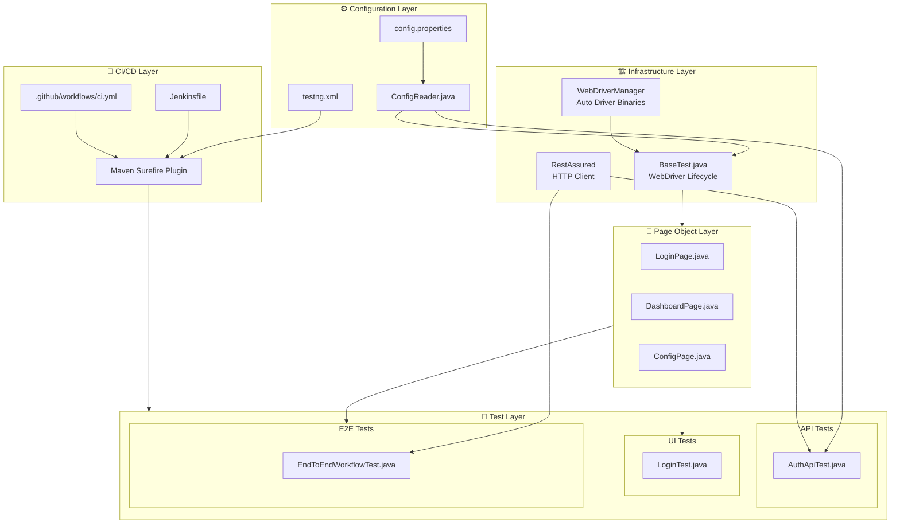
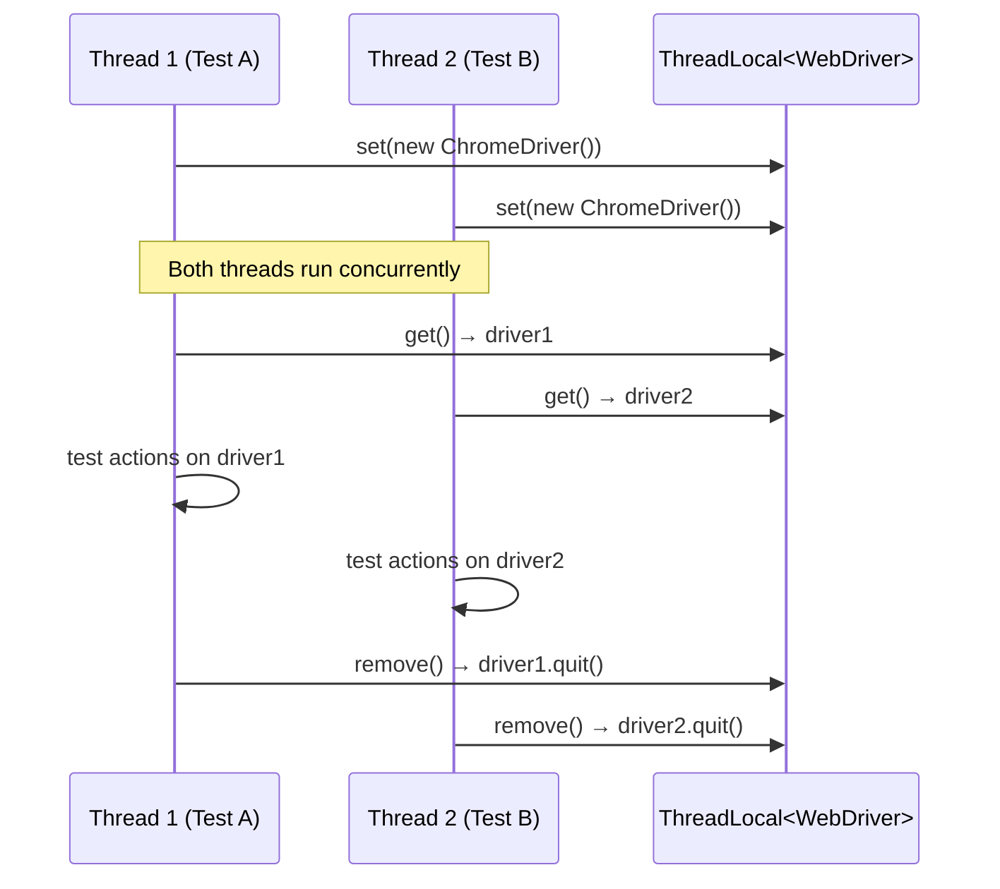
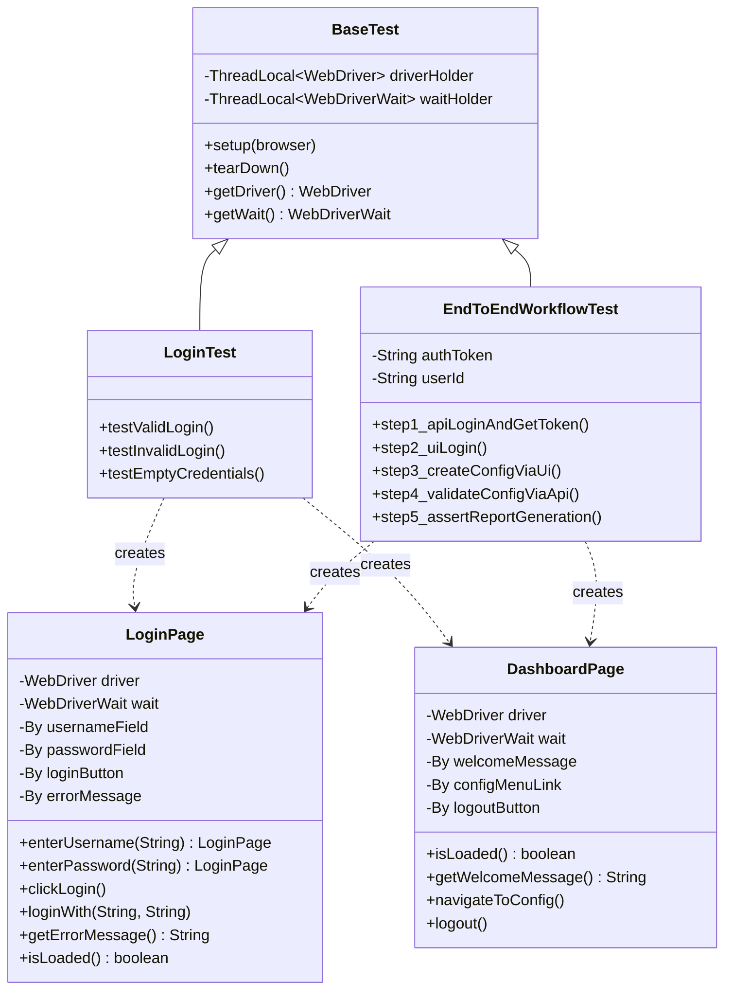
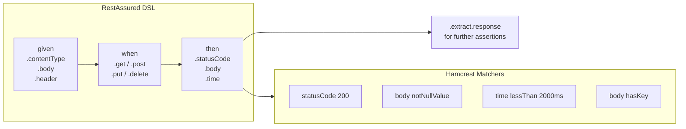
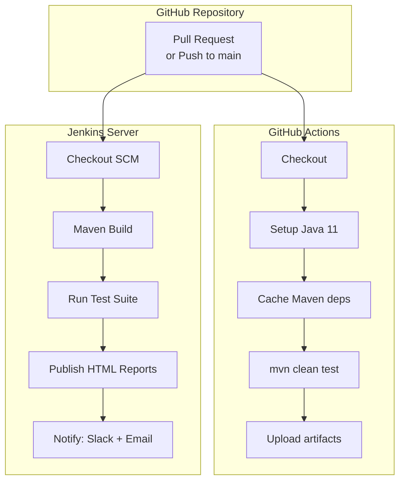

# Automation-Suite — Architecture Documentation

## Overview

Automation-Suite is structured as a layered test automation framework. The design separates concerns into distinct layers: **configuration**, **infrastructure**, **page objects**, and **tests**. This separation makes the framework maintainable, extensible, and resistant to UI churn.

---

## Layered Architecture

---

## Component Descriptions

### Configuration Layer

| Component | Responsibility |
|---|---|
| `config.properties` | Stores environment-specific values: URLs, credentials, timeouts, browser |
| `ConfigReader.java` | Static utility that loads properties at class init, checks JVM system properties first to allow CI override |
| `testng.xml` | Defines test suites, groups, parallelism, and per-suite parameters |

### Infrastructure Layer

| Component | Responsibility |
|---|---|
| `BaseTest.java` | Manages `WebDriver` and `WebDriverWait` lifecycle via `@BeforeMethod` / `@AfterMethod`; uses `ThreadLocal` for parallel safety |
| `WebDriverManager` | Automatically downloads and caches the correct `chromedriver` / `geckodriver` binary for the host OS |
| `RestAssured` | Provides a fluent DSL for HTTP requests; configured with `baseURI` in API test `@BeforeClass` |

### Page Object Layer

Each class represents one screen of the application:

| Page Object | Mapped Screen | Key Methods |
|---|---|---|
| `LoginPage` | `/login` | `enterUsername()`, `enterPassword()`, `clickLogin()`, `getErrorMessage()` |
| `DashboardPage` | `/dashboard` | `isLoaded()`, `getWelcomeMessage()`, `navigateToConfig()` |
| `ConfigPage` | `/config` | `fillForm()`, `submit()`, `getSuccessMessage()` |

### Test Layer

| Package | Test Type | Runs Against |
|---|---|---|
| `tests.ui` | Browser functional | Web UI via Selenium |
| `tests.api` | HTTP contract | REST API via RestAssured |
| `tests.e2e` | Full workflow | Both UI and API in sequence |

---

## WebDriver Thread Safety

Each test thread gets its own isolated `WebDriver` instance. Tests never share browser state.

---

## Page Object Model Design

---

## API Testing Architecture

---

## CI/CD Integration

---

## Design Decisions

### Why TestNG over JUnit?

- Native support for test grouping (`groups = {"ui", "smoke"}`)
- Built-in `@DataProvider` for parameterised tests
- Suite-level XML configuration for parallel execution
- `@Parameters` injection for browser/environment switching per suite

### Why WebDriverManager?

Eliminates the need to manually download and version-match `chromedriver` / `geckodriver` binaries. The library resolves the correct binary for the host OS and Chrome/Firefox version automatically, making the framework zero-config for new team members.

### Why ThreadLocal for WebDriver?

TestNG can run test methods in parallel across threads. A plain `static WebDriver` field would be shared and cause race conditions. `ThreadLocal<WebDriver>` gives each thread its own isolated browser instance with no synchronisation overhead.

### Why separate API and UI layers?

- API tests run in milliseconds; UI tests take seconds. Separating them allows the API suite to run first as a fast sanity check.
- E2E tests deliberately cross both layers to validate the contract between UI actions and backend state — something neither pure API nor pure UI tests can do alone.

### Explicit Waits over Implicit Waits

`WebDriverWait` with `ExpectedConditions` is used for all synchronisation. Implicit waits are set conservatively (10s) as a fallback only. Mixing both can cause wait time to double; explicit waits are preferred because they target a specific condition rather than a blanket timeout.
