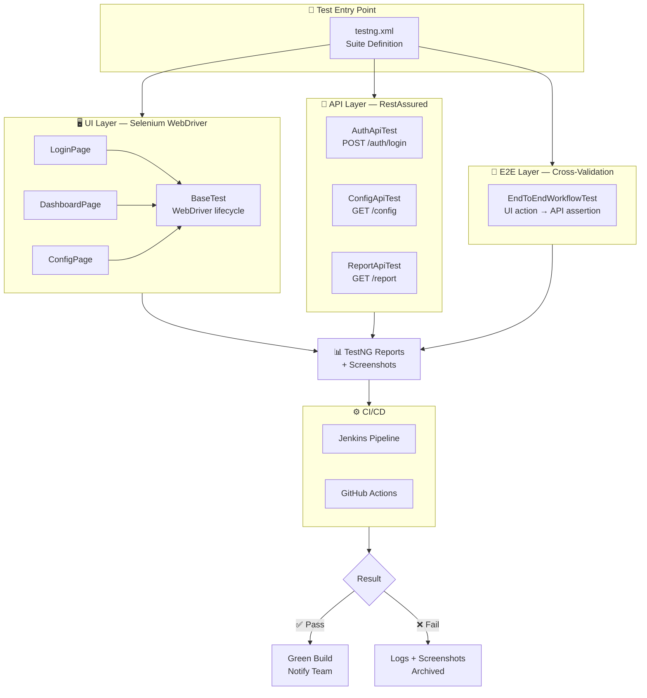
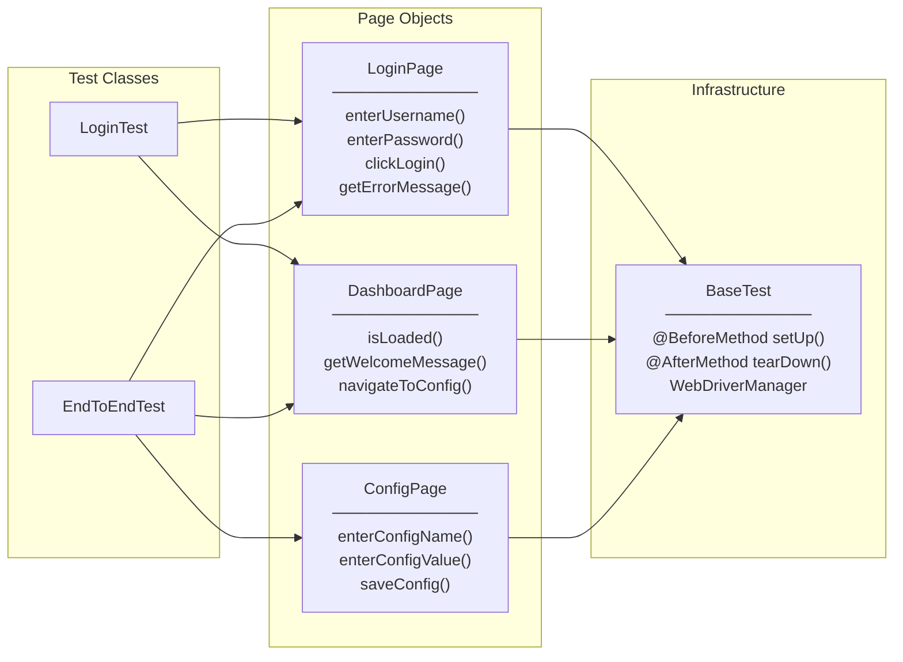
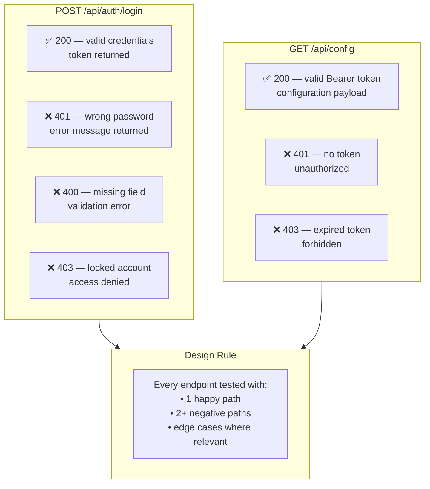
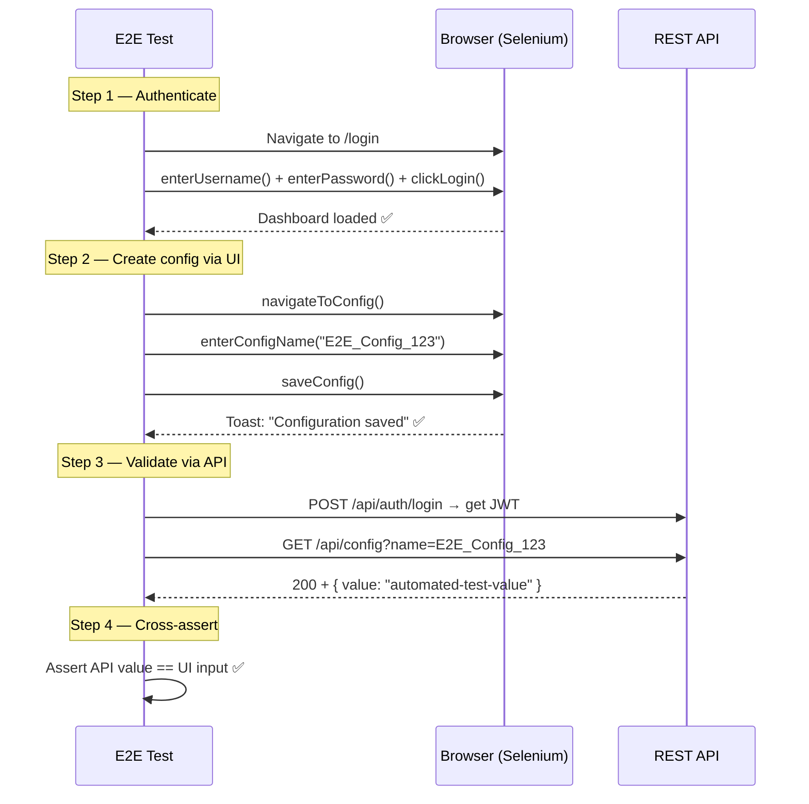
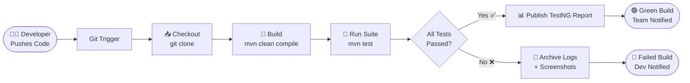

<div align="center">

# 🧪 Automation-Suite

**End-to-End Test Automation Framework for Web Applications & Microservices**

[](https://github.com/Rajshri12/Automation-Suite/actions)
[](https://openjdk.org/projects/jdk/11/)
[](https://www.selenium.dev/)
[](https://testng.org/)
[](https://rest-assured.io/)
[](https://maven.apache.org/)
[](LICENSE)

<br/>

> *Most projects test UI and API in silos. This framework validates complete business workflows — one action on the UI gets confirmed through the API, and every API state change is reflected correctly in the browser.*

<br/>

</div>

---

## 📌 Overview

Automation-Suite is a multi-layer test automation framework built in Java. It covers three distinct testing concerns under a single Maven project:

| Layer | Tool | What it validates |
|-------|------|--------------------|
| **UI** | Selenium + TestNG | Browser interactions, visual flows, form validation |
| **API** | RestAssured + TestNG | HTTP contracts, status codes, payload schema |
| **E2E** | Selenium + RestAssured | Full business workflows crossing both layers |

The key principle: **UI tests and API tests don't live in separate repos.** A single E2E test can log in via the REST API, navigate the browser to a settings page, create a config via the UI, then assert the backend persists it correctly — all in one test method.

---

## 🏗️ System Architecture



---

## 🗂️ Page Object Model

Each screen in the application has exactly one Java class. Tests interact with methods, not with raw Selenium locators. When a locator changes, you edit one file — not every test that touches that screen.



---

## 🔌 API Test Coverage Map



---

## 🔄 End-to-End Sequence

The E2E test validates that what a user does in the browser is accurately persisted and queryable through the API. This catches integration bugs that neither UI-only nor API-only tests can find.



---

## ⚙️ Jenkins CI Pipeline



---

## 📁 Project Structure

```
Automation-Suite/
│
├── 📄 pom.xml                          ← Maven deps (Selenium, TestNG, RestAssured)
├── 📄 Jenkinsfile                       ← Declarative CI pipeline
│
├── src/test/
│   ├── java/
│   │   ├── base/
│   │   │   └── BaseTest.java           ← WebDriver init, teardown, screenshots
│   │   ├── pages/                      ← Page Object Model
│   │   │   ├── LoginPage.java
│   │   │   ├── DashboardPage.java
│   │   │   └── ConfigPage.java
│   │   ├── tests/
│   │   │   ├── ui/
│   │   │   │   └── LoginTest.java      ← UI test cases (positive + negative)
│   │   │   ├── api/
│   │   │   │   └── AuthApiTest.java    ← API contract tests
│   │   │   └── e2e/
│   │   │       └── EndToEndWorkflowTest.java ← Cross-layer validation
│   │   └── utils/
│   │       └── ConfigReader.java       ← Reads config.properties
│   └── resources/
│       ├── config.properties           ← URLs, credentials, browser
│       └── testng.xml                  ← Suite definition + groups
│
├── docs/
│   └── TEST_STRATEGY.md
└── .github/workflows/ci.yml            ← GitHub Actions (API tests on push)
```

---

## 🚀 Running Tests

```bash
# Clone
git clone https://github.com/Rajshri12/Automation-Suite.git
cd Automation-Suite

# Full suite
mvn clean test

# By layer
mvn clean test -Dgroups=ui
mvn clean test -Dgroups=api
mvn clean test -Dgroups=e2e

# Custom suite XML
mvn clean test -DsuiteXmlFile=src/test/resources/testng.xml
```

---

## ⚙️ Configuration

`src/test/resources/config.properties`

```properties
base.url         = http://localhost:3000
api.base.url     = http://localhost:8080
browser          = chrome
implicit.wait    = 10
valid.username   = testuser@example.com
valid.password   = Test@1234
```

---

## 🧪 Test Coverage Summary

| Layer | Test | Type | Status |
|-------|------|------|--------|
| UI | Valid login → dashboard | Positive | ✅ |
| UI | Invalid password → error msg | Negative | ✅ |
| UI | Empty form submit | Negative | ✅ |
| API | `POST /auth/login` 200 | Positive | ✅ |
| API | `POST /auth/login` 401 | Negative | ✅ |
| API | `POST /auth/login` 400 | Negative | ✅ |
| API | `GET /config` no token 403 | Negative | ✅ |
| E2E | Login → create config via UI → validate via API | Workflow | ✅ |

---

## 🤔 Design Decisions

**Why Page Object Model?**
Centralises all locators. When the UI ships a locator change, you update one page class — not every test that touches that screen.

**Why TestNG over JUnit?**
Native grouping (`ui`, `api`, `e2e`), parallel execution config in XML, and data providers are all first-class — no extra libraries needed.

**Why RestAssured?**
The fluent DSL reads almost like a spec: `given().body(payload).when().post("/login").then().statusCode(200).body("token", notNullValue())`. It doubles as documentation.

**Why E2E tests on top of UI + API tests?**
Both layers can pass individually while the integration breaks. E2E tests exist specifically to catch that gap.

---

## 🗺️ Roadmap

- [x] UI automation with POM
- [x] REST API test suite
- [x] Cross-layer E2E tests
- [x] Jenkins CI pipeline
- [ ] Allure HTML reporting
- [ ] Parallel cross-browser (Chrome + Firefox)
- [ ] Playwright migration path
- [ ] AI-assisted test generation for new endpoints

---

<div align="center">

Made with ☕ and too many `mvn clean test` runs.

</div>
