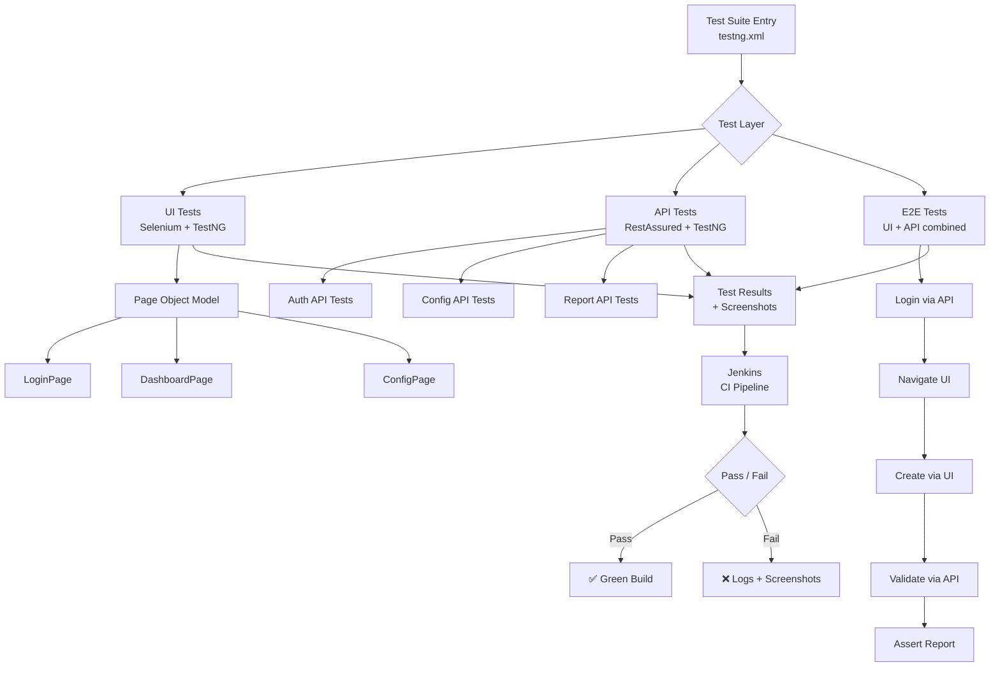
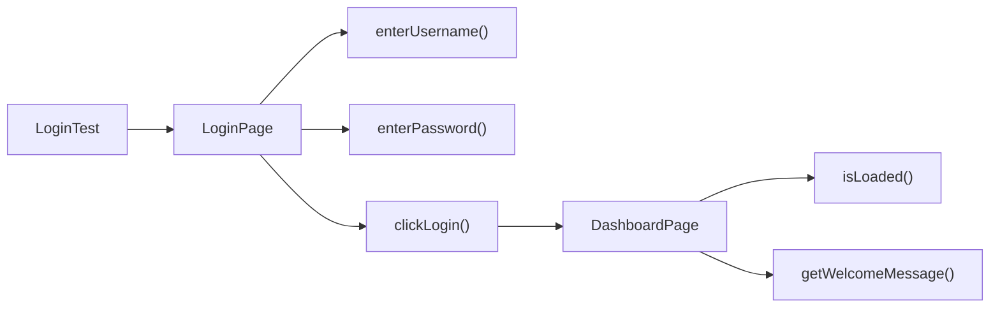
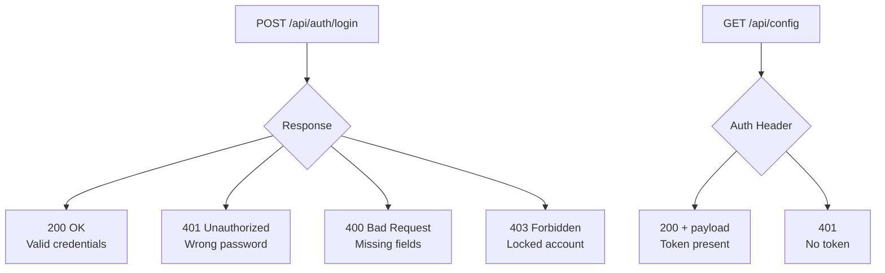
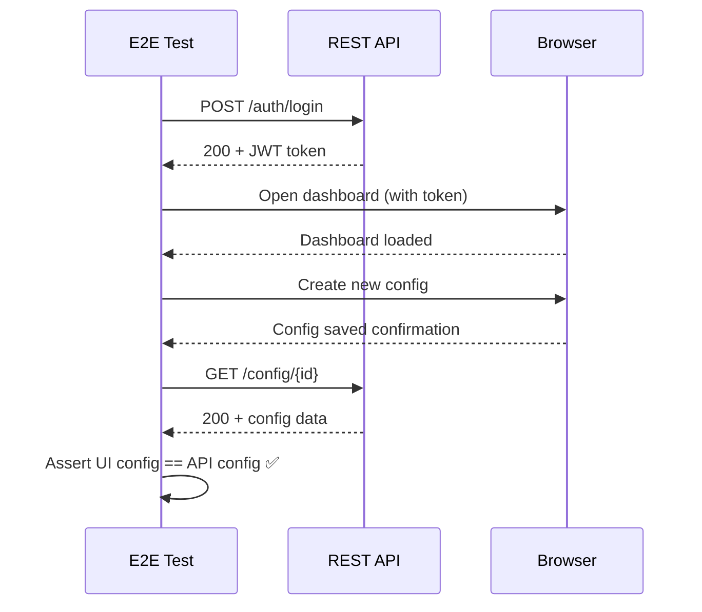
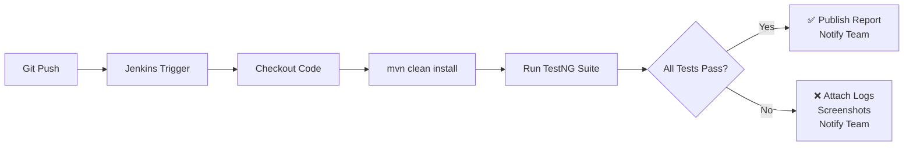

# 🧪 Automation-Suite

[](https://github.com/Rajshri12/Automation-Suite)
[](https://openjdk.org/projects/jdk/11/)
[](https://www.selenium.dev/)
[](https://testng.org/)
[](https://rest-assured.io/)
[](LICENSE)

> End-to-End Test Automation Framework covering UI, API, and full workflow validation for web applications and microservices.

---

## What This Does

Most projects test UI and API in silos. This framework validates **complete business workflows** — an action on the UI gets confirmed through the API, and an API change is reflected correctly in the UI. One suite, both layers.

---

## Architecture



---

## Page Object Model

Instead of writing raw Selenium in every test, each screen is its own class. Tests stay clean; locator changes stay in one place.



---

## API Test Coverage



---

## End-to-End Flow



---

## Jenkins CI/CD Pipeline



---

## Tech Stack

| Tool | Purpose |
|------|---------|
| Java 11 | Core language |
| Selenium WebDriver 4.15 | Browser automation |
| TestNG 7.8 | Test execution, grouping, parallel runs |
| RestAssured 5.3 | REST API assertions |
| WebDriverManager 5.6 | Auto-manages browser drivers |
| Maven | Build and dependency management |
| Jenkins | CI/CD pipeline execution |
| GitHub Actions | Lightweight CI on push |

---

## Project Structure

```
Automation-Suite/
├── src/
│   └── test/
│       ├── java/
│       │   ├── base/
│       │   │   └── BaseTest.java          # WebDriver setup/teardown
│       │   ├── pages/
│       │   │   ├── LoginPage.java         # Login page object
│       │   │   └── DashboardPage.java     # Dashboard page object
│       │   ├── tests/
│       │   │   ├── ui/
│       │   │   │   └── LoginTest.java     # UI test cases
│       │   │   ├── api/
│       │   │   │   └── AuthApiTest.java   # API test cases
│       │   │   └── e2e/
│       │   │       └── EndToEndTest.java  # Full workflow tests
│       │   └── utils/
│       │       └── ConfigReader.java      # Config utility
│       └── resources/
│           ├── config.properties          # Environment config
│           └── testng.xml                 # Suite definition
├── docs/
│   └── TEST_STRATEGY.md
├── Jenkinsfile
├── pom.xml
└── README.md
```

---

## Running the Tests

```bash
# Clone the repo
git clone https://github.com/Rajshri12/Automation-Suite.git
cd Automation-Suite

# Run full suite
mvn clean test

# Run only UI tests
mvn clean test -Dgroups=ui

# Run only API tests
mvn clean test -Dgroups=api

# Run E2E tests
mvn clean test -Dgroups=e2e

# Run specific XML suite
mvn clean test -DsuiteXmlFile=src/test/resources/testng.xml
```

---

## Configuration

Edit `src/test/resources/config.properties`:

```properties
base.url=http://localhost:3000
api.base.url=http://localhost:8080
browser=chrome
implicit.wait=10
valid.username=testuser@example.com
valid.password=Test@1234
```

---

## What Gets Tested

| Layer | Scenario | Type |
|-------|----------|------|
| UI | Valid login | Positive |
| UI | Invalid credentials | Negative |
| UI | Empty form submit | Negative |
| API | Successful auth | Positive |
| API | Wrong password | Negative |
| API | Missing request fields | Negative |
| API | Unauthorized access | Negative |
| E2E | Login → Create config → Validate via API | Workflow |
| E2E | API state reflected correctly in UI | Workflow |

---

## Key Design Decisions

**Why POM?** Centralizes locators — one UI change means one file edit, not hunting through 20 tests.

**Why TestNG over JUnit?** Native support for grouping, parallel execution, and data providers without extra setup.

**Why RestAssured?** Fluent DSL makes API assertions readable — `given().body(payload).when().post("/login").then().statusCode(200)` reads like plain English.

**Why E2E tests?** UI and API tests catch component-level bugs. E2E tests catch integration bugs — the kind that slip through when both layers work individually but break together.

---

## Roadmap

- [ ] Add Allure reporting
- [ ] Parallel browser execution (Chrome + Firefox)
- [ ] Playwright migration for modern browser support
- [ ] AI-assisted test generation for new endpoints
- [ ] Performance test layer (JMeter integration)

<!-- updated -->
