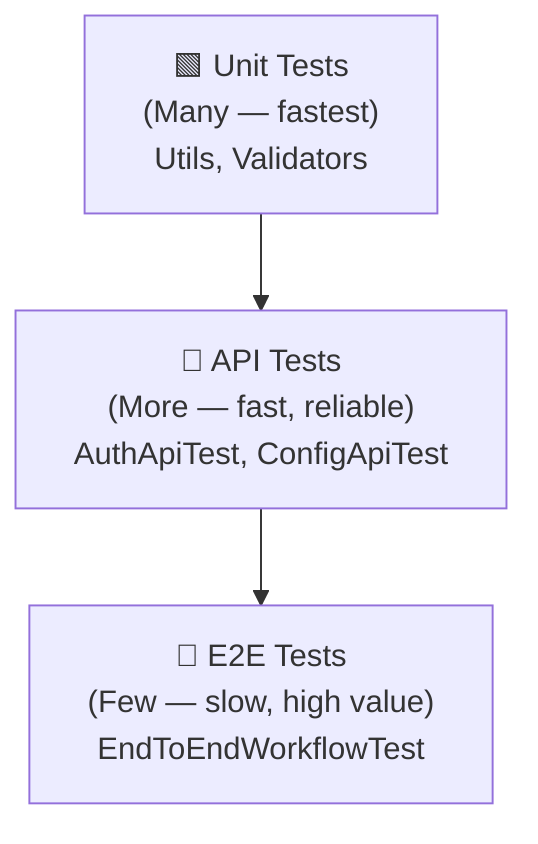

# Test Strategy

## Test Pyramid

The pyramid guides how many tests we write at each layer — not because E2E doesn't matter, but because they're slower to run and harder to debug. Most logic gets caught at the API layer.

---

## What's Automated

| Area | Automated | Reason |
|------|-----------|--------|
| Login flows | ✅ Yes | High frequency, stable UI |
| API auth | ✅ Yes | Critical path, easy to validate |
| Config CRUD | ✅ Yes | Core business logic |
| E2E workflows | ✅ Yes | Catch integration gaps |
| Visual regression | ❌ Not yet | Needs visual tooling |
| Exploratory testing | ❌ Never | Human judgment required |

---

## Test Data

- Properties file (`config.properties`) for environment-specific values
- No hardcoded credentials in test code
- E2E tests generate unique config names using timestamps to avoid collision

---

## Failure Handling

On test failure, the `@AfterMethod` teardown captures a screenshot via Selenium's `TakesScreenshot` interface and saves to `screenshots/`. Jenkins archives these automatically.

---

## Environments

| Environment | When |
|-------------|------|
| Local | Developer runs `mvn test` |
| CI (GitHub Actions) | Every push — API tests only (no browser) |
| Jenkins | Full suite including UI and E2E |

<!-- updated -->
